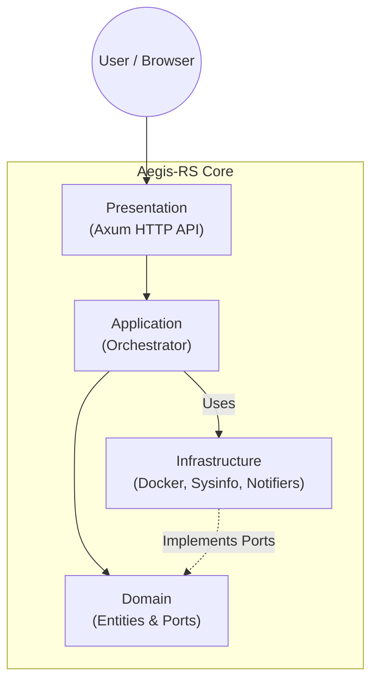

# Aegis-RS

> **Autonomous Self-Healing Infrastructure Orchestrator**
>
> *Built with Rust, Tokio, and Clean Architecture.*


---

**Aegis-RS** is a lightweight, high-performance monitoring and self-healing agent for your servers. It continuously tracks CPU, RAM, and Disk usage alongside your Docker service health, and sends rich status reports with graphs to your team — all with zero external dependencies.

## Features

- **Multi-Metric Monitoring** — Tracks CPU usage, RAM (used/total), Disk usage, and Docker service health every 10 seconds.
- **Self-Healing** — Automatically restarts crashed or unhealthy Docker services and cleans logs on disk pressure.
- **Rich Status Reports** — Sends periodic reports with a PNG chart showing historical trends of all metrics.
- **Multi-Platform Notifications** — Supports **Discord** (live dashboard with editing), **Slack**, and **Microsoft Teams**.
- **Live Web Dashboard** — Auto-refreshing SVG graph available at `http://localhost:3001/graph`.
- **CLI Webhook Management** — Add or list webhooks directly from the command line.
- **Prometheus Endpoint** — Exposes `/metrics` for integration with Grafana or other tools.
- **Clean Architecture** — Hexagonal design for maximum maintainability and testability.

---

## Installation

### Option 1: Download Binary (Recommended)

1. Go to the [Releases](https://github.com/celestingm/Aegis-RS/releases) page.
2. Download the latest `aegis-rs` binary for Linux.
3. Make it executable and run it:

```bash
chmod +x aegis-rs
./aegis-rs
```

### Option 2: Build from Source

```bash
# Prerequisites: Rust toolchain + libfontconfig
sudo apt-get install libfontconfig1-dev

git clone https://github.com/celestingm/Aegis-RS.git
cd Aegis-RS

cargo build --release
./target/release/aegis-rs
```

---

## Configuration

Copy the example config file and edit it:

```bash
cp config.example.toml config.toml
```

```toml
# config.toml
api_port = 3001
# REQUIRED to enable /webhook. Generate one with: openssl rand -hex 32
secret_token = "change-me-to-a-secure-token"
disk_threshold = 90
docker_services = ["grafana", "prometheus", "backend", "frontend"]

# Discord Webhook (Live Dashboard - updates the same message)
[[webhooks]]
url = "https://discord.com/api/webhooks/YOUR_ID/YOUR_TOKEN"
provider = "discord"

# Microsoft Teams (Hourly report)
# [[webhooks]]
# url = "https://your-teams-workflow-url"
# provider = "teams"

# Slack (Hourly report)
# [[webhooks]]
# url = "https://hooks.slack.com/services/YOUR/SLACK/HOOK"
# provider = "slack"
```

Run with a custom config path:

```bash
./aegis-rs --config /etc/aegis/config.toml
```

### Docker

```bash
docker build -t aegis-rs .
docker run -d --name aegis-rs -p 3001:3001 \
  -v $(pwd)/config.toml:/app/config.toml:ro \
  -v /var/run/docker.sock:/var/run/docker.sock \
  aegis-rs
```

`config.toml` is not baked into the image (it holds secrets): mount your own. Mounting the Docker
socket gives Aegis-RS control over the host's containers, so only do it on hosts you trust.

---

## CLI: Webhook Management

```bash
# Add a webhook
./aegis-rs webhook add --url "https://discord.com/api/webhooks/..." --provider discord

# List configured webhooks
./aegis-rs webhook list
```

---

## API Reference

| Endpoint   | Method | Description                             | Auth |
| :--------- | :----- | :-------------------------------------- | :--: |
| `/metrics` | `GET`  | Prometheus-compatible metrics output.   | No   |
| `/graph`   | `GET`  | Live auto-refreshing SVG graph.         | No   |
| `/webhook` | `POST` | Trigger manual remediation actions.     | Yes  |

The `/webhook` endpoint requires a `Bearer` token matching `secret_token` in your config:

```bash
curl -X POST http://localhost:3001/webhook \
  -H "Authorization: Bearer <your secret_token>" \
  -H "Content-Type: application/json" \
  -d '{"action": "restart", "target": "grafana"}'
```

Supported actions: `restart` (with a `target` container name) and `clean_logs`.

> **Security:** the endpoint is **disabled** (`503`) until you set a real `secret_token`.
> Empty values and the `change-me` placeholders are rejected. Tokens are compared in constant time,
> and `target` must be a valid Docker container name. See [SECURITY.md](SECURITY.md).

---

## Architecture

Aegis-RS follows **Clean Architecture** (Hexagonal) principles.



- **Domain** — Pure Rust structs (`SystemMetrics`, `Alert`, `HealthStatus`) and port trait definitions. Zero external dependencies.
- **Application** — The `Orchestrator` event loop driving health checks, remediation, graph generation, and notification dispatch.
- **Infrastructure** — Concrete adapters: `SystemMonitor` (sysinfo), `DockerMonitor`, `WebhookNotifier` (reqwest), `FileConfigLoader`.
- **Presentation** — Axum-based HTTP server exposing metrics, graph, and webhook endpoints.

---

## Development

```bash
make ci   # fmt, clippy, tests, release build
```

## Security

Found a vulnerability? See [SECURITY.md](SECURITY.md).

## License

[MIT](LICENSE)
