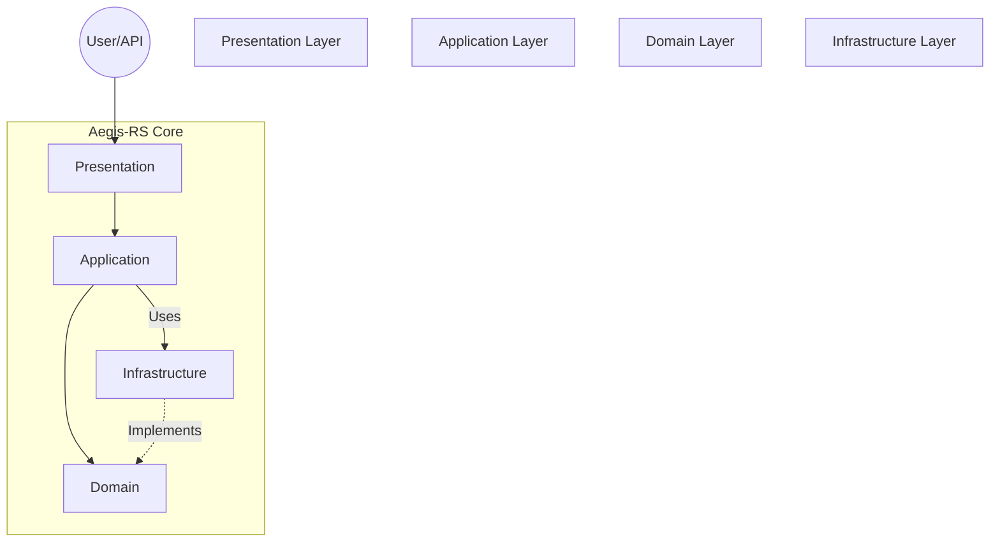

# Aegis-RS

> **Autonomous Self-Healing Infrastructure Orchestrator**
> 
> *Built with Rust, Tokio, and Clean Architecture.*


---

**Aegis-RS** is a lightweight, high-performance monitoring and remediation agent. It watches your system's resources and services, and **automatically fixes problems** before you even wake up.

## Key Features

- **Auto-Discovery**: No manual config needed. Just add `labels: ["aegis.monitor=true"]` to your Docker containers.
- **Blazing Fast**: Compiled to native binary. Minimal CPU/RAM footprint (~5MB).
- **Self-Healing**:
  - Restarts crashed/unhealthy Docker services.
  - Cleans system logs when disk usage spikes.
- **Real-time Alerts**: Webhook integration for Discord, Slack, or Telegram.
- **Visual Insights**: Native SVG graph generation for historical metrics.
- **Clean Architecture**: Designed for maintainability, testability, and modularity.

---

## Installation

### Option 1: Download Binary (Recommended)
1. Go to the [Actions Tab](https://github.com/celestingm/Aegis-RS/actions).
2. Click the latest workflow run on `main`.
3. Download the `aegis-rs-linux` artifact.
4. `chmod +x aegis-rs && ./aegis-rs`

### Option 2: Build from Source
```bash
# Clone the repository
git clone https://github.com/celestingm/Aegis-RS.git
cd Aegis-RS

# Build release binary
cargo build --release

# Run
./target/release/aegis-rs
```

---

## Usage

### 1. Tag Your Containers
Add the label to any service you want to monitor in `docker-compose.yml`:

```yaml
services:
  my-critical-app:
    image: nginx:latest
    labels:
      - "aegis.monitor=true"  # <--- That's it!
```

### 2. Configure (Optional)
Aegis-RS runs with sensible defaults, but you can override them via `config.toml`:

```toml
# config.toml
api_port = 3001
secret_token = "my-secure-token"
disk_threshold = 95
webhook_url = "https://discord.com/api/webhooks/..."

# Optional: Manual list (if you don't use labels)
# docker_services = ["postgres", "redis"]
```

Run with config:
```bash
./aegis-rs --config /path/to/my-config.toml
```

---

## API Reference

The agent exposes a lightweight HTTP API.

| Endpoint | Method | Description | Auth Required |
| :--- | :--- | :--- | :---: |
| `/metrics` | `GET` | Prometheus-compatible metrics. | ❌ |
| `/graph` | `GET` | SVG visualization of system load. | ❌ |
| `/webhook` | `POST` | Trigger manual remediation actions. | ✅ |

**Example Graph Output:**
> *The `/graph` endpoint returns a generated SVG like this:*
> 
> 

---

## Architecture

Aegis-RS follows **Clean Architecture** (Hexagonal) principles to decouple business logic from infrastructure details.



- **Domain**: Pure business entities (`HealthStatus`, `Alert`) and interface definitions (`Ports`).
- **Application**: The `Orchestrator` loop that drives the logic.
- **Infrastructure**: Adapters for Docker, Disk I/O, and HTTP Notifiers.
- **Presentation**: Axum web server.

---

## License

MIT License.
